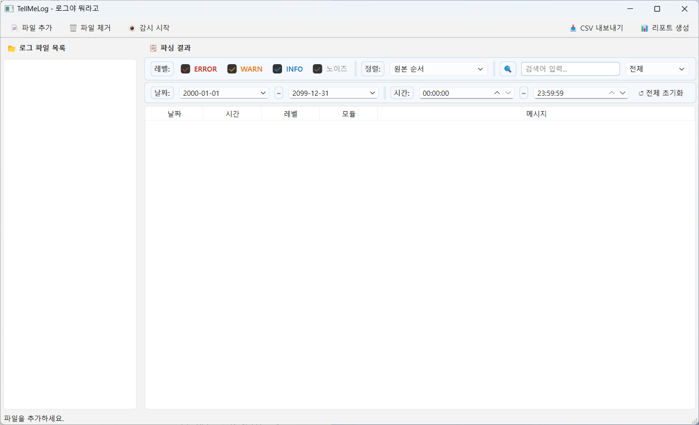

# TellMeLog (로그야 뭐라고)

**Qt/C++ 기반 로그 파일 분석 데스크톱 툴**

생산기술 · 장비 제어 · 테스트 자동화 환경에서 발생하는 로그를  
빠르게 파싱하고, 필터링하고, 리포트로 출력하는 데스크톱 애플리케이션입니다.



---

## 📌 배경 및 목적

장비 제어 및 테스트 자동화 소프트웨어 직무에서는  
여러 모듈에서 동시에 생성되는 로그 파일을 빠르게 분석하는 것이 핵심 역량입니다.

실무에서는 로그 파일을 메모장이나 텍스트 에디터로 열어 수작업으로 분석하는 경우가 많고,  
여러 장비의 로그를 시간 순서대로 교차 분석할 때 특히 어려움이 큽니다.

TellMeLog는 이 문제를 직접 해결하기 위해 제작했습니다.

- 다양한 포맷의 로그 파일을 즉시 파싱하여 구조화된 테이블로 표시
- 여러 파일을 타임스탬프 기준으로 병합해 시간 흐름 파악
- 오류 패턴을 PDF 리포트로 요약 출력

C++/Qt를 선택한 이유는 장비 제어·생산기술 직무에서 Qt 기반 GUI 툴이 광범위하게 사용되기 때문입니다.

---

## ✨ 주요 기능

| 기능 | 설명 |
|---|---|
| **로그 파싱** | 3가지 타임스탬프 포맷 자동 인식, 1MB 기준 자동/수동 파싱 분기 |
| **다중 파일 병합** | 체크박스로 파일 선택 → 타임스탬프 기준 자동 병합, 파일별 고유 색상 구분 |
| **필터 & 검색** | 레벨 토글(ERROR/WARN/INFO/노이즈), 날짜·시간 범위, 실시간 키워드 검색 |
| **실시간 감시** | QFileSystemWatcher 기반 tail -f 방식, 신규 행 하이라이트 후 페이드 아웃 |
| **CSV 입출력** | BOM UTF-8 저장(엑셀 호환), RFC 4180 준수, CSV 파일 읽기 지원 |
| **PDF 리포트** | 레벨별 통계, 모듈별 오류 순위, ERROR/WARN 상세 목록 |

---

## 🎬 데모


> 1. 파일 추가 → 자동 파싱 → 로그 표시
> 2. ERROR 필터 → 키워드 검색 → 결과 확인
> 3. 다중 파일 선택 → 타임스탬프 병합 뷰
> 4. PDF 리포트 생성
> 5. 실시간 감시 → 새 로그 자동 갱신

---

## 🏗 아키텍처

```
로그 파일 (.log / .csv)
        │
        ▼
  ┌─────────────┐
  │  LogParser  │  ← QRegularExpression 기반 파싱
  │             │     3가지 타임스탬프 포맷 지원
  └──────┬──────┘
         │  QVector<LogEntry>
         ▼
  ┌─────────────┐
  │  LogEntry   │  ← 공통 데이터 모델
  │  (구조체)    │     date / time / level / module / message / sourceFile
  └──────┬──────┘
         │
         ▼
  ┌─────────────────────┐
  │   Filter Engine     │  ← applyFilters()
  │                     │     레벨 / 날짜 / 시간 / 검색어 / 정렬
  └──────┬──────────────┘
         │
         ▼
  ┌─────────────┐     ┌──────────────────┐     ┌─────────────┐
  │ Table View  │     │  ReportGenerator │     │ CsvExporter │
  │(QTableWidget│     │  (PDF 리포트)    │     │ (CSV 저장)  │
  └─────────────┘     └──────────────────┘     └─────────────┘

  ┌──────────────────────────┐
  │  QFileSystemWatcher      │  ← 실시간 감시
  │  parseTail() + offset    │     마지막 읽은 위치 이후만 파싱
  └──────────────────────────┘
```

**핵심 설계 원칙:** `m_allEntries`에 전체 파싱 결과를 보관하고,  
필터/정렬은 재파싱 없이 `applyFilters()`로만 처리합니다.

---

## 🔧 기술적 도전

### 1. 다양한 타임스탬프 포맷 지원

**문제:** 장비마다 로그 날짜 포맷이 달랐습니다.
```
2024-01-15 09:23:45.123        # 표준
2024/01/15 09:23:45            # 슬래시
15/01/2024 09:23:45            # DD/MM/YYYY
2024-01-15T09:23:45.123+09:00  # ISO 8601
```

**해결:** `QRegularExpression`으로 3가지 패턴을 순차 매칭하고,  
파싱된 날짜는 `QDateTime`으로 정규화하여 내부적으로 통일된 형태로 저장합니다.  
이를 통해 DD/MM/YYYY 포맷도 정렬 시 오작동 없이 처리됩니다.

---

### 2. 다중 파일 병합 및 시간 순 정렬

**문제:** 여러 장비의 로그를 시간 흐름에 따라 교차 분석하기 어렵습니다.

**해결:** 모든 파일의 `LogEntry`를 단일 `QVector`로 병합한 뒤  
타임스탬프 기준으로 정렬합니다. 출처 파일은 `sourceFile` 필드와  
파일별 고유 파스텔 색상으로 구분하여 병합 후에도 출처를 즉시 파악할 수 있습니다.

---

### 3. 실시간 로그 감시 (tail -f 방식)

**문제:** 장비가 동작하는 동안 로그가 계속 추가되므로,  
매번 전체 파일을 재파싱하면 성능 문제가 발생합니다.

**해결:** `QFileSystemWatcher`로 파일 변경을 감지하고,  
`m_fileTailPos`에 파일별 마지막 읽기 offset을 기록합니다.  
`parseTail()`은 offset 이후의 새 줄만 파싱하여 기존 데이터에 append합니다.  
파일 삭제 후 재생성(atomic save) 시에는 500ms 후 재등록 + 전체 재파싱으로 처리합니다.

---

### 4. 필터 성능 — 재파싱 없는 show/hide

**문제:** 레벨 토글, 날짜 범위, 키워드 검색을 바꿀 때마다 파일을 다시 읽으면  
대용량 파일에서 응답성이 떨어집니다.

**해결:** 파싱 결과 전체를 `m_allEntries`에 보관하고,  
`applyFilters()`에서 조건에 맞는 항목만 `populateTable()`로 표시합니다.  
파일 I/O 없이 메모리 내 필터링만 수행하므로 즉각적인 응답이 가능합니다.

---

## 📊 성능 측정

> *실측값 추가 예정 — 파일 크기별 파싱 시간 측정 후 기재*

| 파일 크기 | 파싱 시간 |
|---|---|
| 1 MB | 측정 예정 |
| 10 MB | 측정 예정 |
| 50 MB | 측정 예정 |

---

## 🖼 UI 구조

```
┌────────────────────────────────────────────────────────────────────────┐
│  [📄 파일 추가]  [🗑 파일 제거]  [👁 감시]       [📥 CSV]  [📊 리포트] │
├───────────────────┬────────────────────────────────────────────────────┤
│ 📂 로그 파일 목록 │  레벨: ☑ERROR ☑WARN ☑INFO ☑노이즈  정렬▼  🔍검색 │
│                   ├────────────────────────────────────────────────────┤
│ ☑ file_a.log     │  날짜: [yyyy-mm-dd] ~ [yyyy-mm-dd]                  │
│ ☑ file_b.log     │  시간: [HH:mm:ss]  ~ [HH:mm:ss]           [↺초기화] │
│ □ file_c.log      ├────────────────────────────────────────────────────┤
│                   │  날짜 │ 시간 │ 레벨 │ 모듈 │ 메시지                 │
│                   │  (파일별 고유 색상으로 출처 구분)                   │
└───────────────────┴────────────────────────────────────────────────────┘
│ 상태바: 표시 N줄 / 전체 N줄  |  병합: N개 파일  |  👁 감시 중: N개       │
└────────────────────────────────────────────────────────────────────────┘
```

---

## 🛠 기술 스택

| 항목 | 내용 |
|---|---|
| 언어 | C++17 |
| 프레임워크 | Qt 6.11 (Qt Widgets) |
| 빌드 시스템 | CMake |
| 컴파일러 | MinGW 64-bit |
| 주요 Qt 모듈 | QRegularExpression, QFileSystemWatcher, QPrinter, QPrintPreviewDialog |
| OS | Windows |

---

## 🔨 빌드 방법

**요구사항**
- Qt 6.5 이상
- CMake 3.19 이상
- MinGW 64-bit 또는 MSVC

```bash
git clone https://github.com/paaye7313/TellMeLog.git
cd TellMeLog
cmake -B build
cmake --build build
```

또는 Qt Creator에서 `CMakeLists.txt`를 열어 바로 빌드할 수 있습니다.

---

## 🧪 테스트 로그 파일

`testdata/logs/` 디렉토리에 파서 테스트용 샘플 파일이 포함되어 있습니다.

| 파일 | 설명 |
|---|---|
| `test_normal.log` | 표준 포맷 정상 로그 |
| `test_mixed.log` | WARN/ERROR, 노이즈, 타임스탬프 혼재 케이스 |

---

## 📝 회고

초기 개발 단계에서는 빠른 기능 검증을 위해 MainWindow 중심으로 구현했습니다.  
기능이 늘어나면서 로그 파싱(`LogParser`) 모듈을 별도로 분리하여  
MainWindow가 UI와 흐름 제어에 집중할 수 있도록 구조를 개선했습니다.

가장 까다로웠던 부분은 **DD/MM/YYYY 포맷의 정렬 버그**였습니다.  
문자열 비교로는 날짜 순서가 틀리게 정렬되는 문제를 `QDateTime` 정규화로 해결하면서,  
포맷 독립적인 날짜 처리의 중요성을 실감했습니다.

---

## 개발 현황

- [x] 개발 환경 세팅
- [x] UI 레이아웃 구성
- [x] 로그 파일 파싱
- [x] CSV 내보내기 / 읽기
- [x] 필터 바 (레벨 / 날짜 / 시간 / 정렬)
- [x] 실시간 검색
- [x] 리포트 생성 (PDF)
- [x] 다중 파일 병합 뷰
- [x] 실시간 로그 감시 (QFileSystemWatcher)